# RunZoo

An animal runs across your menu bar as fast as your machine is busy, and wears
the colour of how bad it is. Idle, it strolls in plain white; overloaded, it
sprints in red.

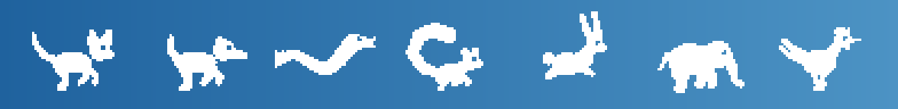

macOS and Windows · Rust · minimal dependencies · 564KB bundle

## Get it

<p align="center">
  <a href="https://github.com/wangjacsi/RunZoo/releases/latest/download/RunZoo.zip">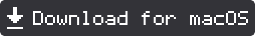</a>
  &nbsp;&nbsp;
  <a href="https://github.com/wangjacsi/RunZoo/releases/latest/download/RunZoo-windows-x64.zip"></a>
</p>

<p align="center">
  <sub>macOS: Apple silicon and Intel, ~520KB · Windows: 64-bit, ~190KB<br>
  No Rust, no toolchain, nothing else to install. Both links always give the newest build.</sub>
</p>

Then:

**macOS** — unzip and drag `RunZoo.app` into Applications. The build is ad-hoc
signed rather than notarised, so macOS quarantines the download; clear it once:

```sh
xattr -dr com.apple.quarantine /Applications/RunZoo.app
open /Applications/RunZoo.app
```

**Windows** — unzip and run `runzoo.exe`. The animal appears in the notification
area; right-click it for the dashboard. It is unsigned, so SmartScreen asks once
(More info → Run anyway). To start it with Windows, put a shortcut in
`shell:startup`.

Older versions, and what changed in each, are on the
[releases page](https://github.com/wangjacsi/RunZoo/releases).

## Or build it yourself

On a Mac with nothing installed yet, one command. It installs the Xcode Command
Line Tools and Rust if they are missing, builds, installs into `/Applications`
and launches:

```sh
curl -fsSL https://raw.githubusercontent.com/wangjacsi/RunZoo/main/tools/install.sh | bash
```

Already have a checkout? `./tools/install.sh`, and add `--login-item` to start it
at login. (By hand, that is System Settings → General → Login Items → add
`/Applications/RunZoo.app`.)

**Build only.** On macOS, `./tools/bundle.sh` writes `dist/RunZoo.app`; add
`--universal` for a binary that runs on both Apple silicon and Intel. On
Windows, `cargo build --release` is the whole story — the result is
`target\release\runzoo.exe` and it needs nothing beside it.

## Seven animals

| | | | | | | |
|:-:|:-:|:-:|:-:|:-:|:-:|:-:|
| 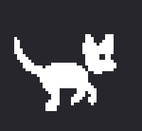 | 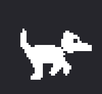 | 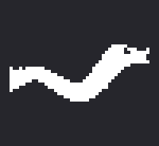 | 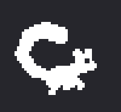 | 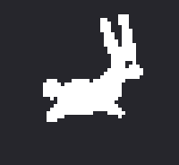 | 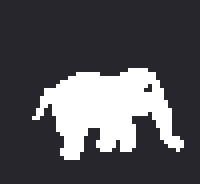 | 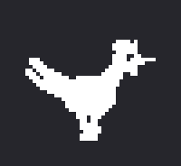 |
| Cat | Dog | Rattlesnake | Squirrel | Rabbit | Elephant | Chicken |

The menu bar icon is drawn as a silhouette. Colour is carried by the fill, so
the seven have to be told apart **by shape alone** — which is how you recognise
an animal anyway: the elephant by its trunk, the rabbit by its ears, the
squirrel by its tail, the chicken by its comb, the rattlesnake by its S and its
rattle.

One stride is eight frames, and the busier the machine the faster they play:

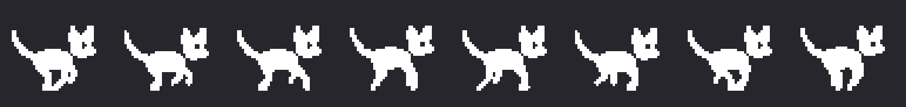

At the same load each animal walks at its own tempo. The elephant ambles at
0.6x, the squirrel fusses at 1.4x (`src/animal.rs`).

## What it does

**Mini dashboard** — click the icon and the last 60 seconds of CPU, memory,
disk, network and battery each appear as a small graph. The one driving the
animal leads the list, drawn a size up, and stays there whichever you pick, so
the eye does not have to hunt for the checkmark. Readings are right-aligned in
a column of their own, which is the difference between a list of numbers and a
table of them.

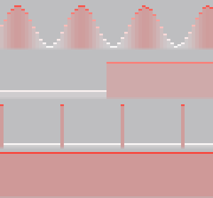

Each column takes the colour of its own reading, so a graph is a trace of
severity over time rather than one flat tint: a calm minute stays pale and the
spike in the middle of it stands out red. Graphs span their full width from the
very first second — until a whole minute has been collected the left is carried
back from the oldest reading and drawn faint. A placeholder rather than a
measurement, but enough to see at a glance that the app is alive and reading.

**Pick what sets the speed** — click a row and that value drives the animal.
Pick battery and it runs more frantically the less charge is left.

**Somewhere to go when a number looks wrong** — under the process list,
**Open Activity Monitor** hands you over to the tool that can actually end
something. RunZoo names the culprit; it does not kill it. Ending a process from
a menu you opened to look at a graph is not a monitor's job, and the system
already ships something that does it properly.

**Severity in colour** — see below.

**Overload alert, with the culprit** — if the chosen value stays above 85% for
more than 30 seconds you get a notification naming the process using the most.
It clears once the value drops back under 70%, which stops it chattering at the
boundary.

## Severity in colour

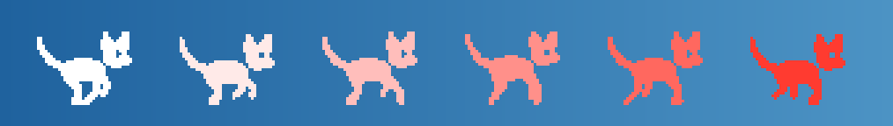

Every source is normalised to 0..100, so one ramp turns any of them into "how
bad is this" and then into a colour. Above: the same cat at 0%, 25%, 50%, 70%,
85% and 100%.

The colour shows up in three places: the **animal in the menu bar**, painted for
whichever source is driving it; **every row of the dashboard**, coloured sample
by sample; and the **palette itself**, where each entry is drawn as the whole
gradient it would paint with, so you pick a ramp you can see rather than the
name of a colour.

Pick the accent under **Severity colour** in the menu: red (the default),
orange, yellow, green, teal, blue, purple, pink, or monochrome to switch the
whole thing off and go back to the plain template icon.

```
severity = (load / 100) ^ 1.6
colour   = white + (accent - white) * severity
```

The exponent pushes the visible part of the ramp into the busy half: a machine
at 30% is only faintly tinted, one at 90% is unmistakable. It never goes flat,
so the colour always moves when the load moves.

**The calm end is white in both appearances.** On a light menu bar that means an
idle animal is white on near-white and very nearly disappears until the load
picks up; from about half load it is legible again. That is a deliberate trade:
the ramp reads as one thing, "white to red", wherever you are. Anyone who wants
the old behaviour has the **Monochrome** accent, which hands the tinting back to
macOS and adapts to either appearance. The dashboard graphs sit on a light plate
for the same reason — white on a light menu is nothing at all, so the graph gets
its own ground to stand on.

Severity is quantised to 32 steps, and the eight animation frames are repainted
only when the step changes — not on every tick, and never in monochrome mode,
where macOS does the tinting for us.

## Speed maths

The RunCat curve, multiplied by each animal's tempo.

```
speed          = max(1, load% / 5) x tempo
frame interval = 500 / speed  ms   (clamped to 33ms .. 500ms)
```

Load 0% → 500ms (2fps, a stroll) · load 100% → 33ms (30fps, a sprint).

The 30fps ceiling comes from measurement. At 45fps the animation cost more CPU
with no visible difference. **An app that measures load must not create it.**

## Measurements

| | |
|---|---|
| Bundle size | 564KB for one architecture (467KB binary) · about 1.0MB universal |
| Memory | about 45MB resident |
| Idle CPU | about 2.5% (1.35% measuring + 1.2% animating) |
| CPU at full load | about 5.5% |

The two CPU rows were measured on the monochrome build. Colour was measured
against it side by side, both running for the same minute on the same busy
machine (system load 140–250%, so the animation was near its 30fps ceiling):
median 5.4% with colour against 4.95% without, twelve samples each. Half a
percentage point, at the edge of the run-to-run noise — the repaint only fires
when the severity step moves, and costs about 11k pixel writes when it does.

Two things worth writing down from measuring.

**The status item must be variable length.** Fix its length and macOS refits the
image every frame, which took CPU from 8% to 26% at 40fps (measured three times,
alternating). That is the opposite of the intuition, so it is a comment in
`src/mac.rs`.

**Disk throughput agrees with `iostat`.** During a sustained write we read
7.5–8.0 GB/s against `iostat`'s 7.7–7.9 GB/s.

## Known limits

**Disk I/O from short-lived processes is missed.** Throughput is summed per
process, so anything born and dead between two refreshes (2 seconds) is never
observed. Writing 800MB with `dd` shows up as 35KB/s. Work made of many brief
processes, like a compile, reads lower than it is. Fixing it properly means
reading IOKit's block device statistics directly.

**Memory can disagree with Activity Monitor.** We use `sysinfo`'s definition
(total − available), which counts cache and compressed memory differently to
macOS, so it reads lower.

## How it is put together

```
metrics.rs   five sources, all normalised to 0..100
tint.rs      that number → a severity → a colour
draw.rs      pixels: the animal, the sparklines, the swatches
menu.rs      what the menu says, as data
state.rs     what the app knows and how a second changes it
prefs.rs     the four settings, wherever the platform keeps such things
sys.rs       notifications, and the way to the task manager
mac.rs       AppKit: pixel buffers → NSImage, menu nodes → NSMenu
win.rs       Win32: pixel buffers → HICON, menu nodes → HMENU
```

Only the last two know what a window is. That is why every `--dump-*` flag below
works with no menu bar in sight, why the pictures in this README are generated
from the same sprites the app runs on, and why the two fronts cannot drift apart
about what is measured, what is drawn, or what the menu says.

## Windows

The same app, against a very different API, with two differences the platform
forces:

**The tray icon is square and small.** `SM_CXSMICON` is usually 16 or 24 pixels,
where a menu bar will happily hold something wide. The animal is box-filtered
down to fit and centred, which keeps a one-pixel leg as a grey line instead of
losing it the way nearest-neighbour would.

**A menu row shows a checkmark or a bitmap, not both.** Rows carrying a graph go
without the checkmark; the row driving the animal is the one at the top of the
list, and the submenu labels name the current animal and colour anyway.

Everything else is the same: the seven animals, the ramp, the dashboard, the
overload alert (a tray balloon rather than a notification), and **Open Task
Manager** where macOS says Activity Monitor. Settings live in
`%APPDATA%\RunZoo\settings.conf` rather than NSUserDefaults.

The binary is built as a GUI subsystem app so that double-clicking it does not
open a console window. The `--dump-*` flags still print: they attach to the
console that launched them.

⚠️ **Honest status.** The Windows front is written, compiles for
`x86_64-pc-windows-msvc`, passes clippy, and CI builds it on a Windows runner
and runs `--probe` and `--dump-menu` against a real machine there. Nobody has
yet sat in front of the tray and clicked it. If something looks wrong, it will
be in `src/win.rs` and nowhere else — everything it draws is checkable with the
dump flags on any platform.

## Redrawing the animals

Sprites are assembled from shapes rather than punched in pixel by pixel: bodies,
heads and tails as ellipses and tapering curves, with the leg phase rotated each
frame.

```sh
python3 tools/gen_sprites.py         # refreshes assets/animals/* and src/sprites.rs
python3 tools/gen_readme_images.py   # refreshes the pictures above
open assets/animals/_contact_sheet.png   # seven species x 8 frames, side by side
```

Change the numbers, run it again, look at the sheet. Pure Python, no
dependencies — the PNG encoder is in there too.

The animals are laid out in 40x36 drawing units and rasterised at `SCALE`, which
is 10/9 — so 44x40 pixels, shown at 22x20pt. That is as large as they go: the
menu bar is 22pt tall, a Retina point is two pixels, and anything that is not a
whole number of pixels per point turns a hard-edged silhouette soft. Raising
`SCALE` means raising the point size in `src/mac.rs` to match.

Each frame is written twice: a PNG to look at, and a 1-bit mask (220 bytes) that
the binary embeds. The mask is what the app draws from, so the sprite pipeline
needs no image decoder and is the same three lines everywhere.

## Developer flags

```sh
runzoo --probe 10        # print measurements, with severity and colour, no GUI
runzoo --dump-menu       # print the menu as built, no clicking; dumps its graphs
runzoo --dump-tint       # print the whole colour ramp
runzoo --dump-sprites    # every animal across the ramp  → /tmp/runzoo_sprites.raw
runzoo --dump-spark-demo # sparklines from synthetic data → /tmp/runzoo_spark.raw

python3 tools/raw_to_png.py /tmp/runzoo_sprites.raw 240 252
python3 tools/raw_to_png.py /tmp/runzoo_spark.raw 120 28 --bg=light --scale=3
```

`--bg` is the one that matters for anything involving colour. A dump on a
checkerboard tells you the pixels are there; a dump on `--bg=light` tells you
whether a human could see them.

## Buy me a coffee

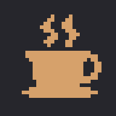

RunZoo is free and always will be. If it has earned its place in your menu bar,
[**buy me a coffee**](https://buy.stripe.com/5kQfZg7p7dCX5bv9jy8bS00) — you
choose the amount, five dollars to start with.

The same cup is in the app's own menu, under the overload alert. It is drawn by
the sprite generator like everything else here, so there is no stock icon in
this repository.

<br clear="left">

## Credit

Started from the idea in RunCat365 (Takuto Nakamura, Apache-2.0). What was taken
and what was not is spelled out in [NOTICE](NOTICE).
